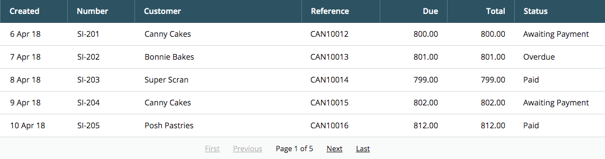

# Coding Challenge
> This coding challenge is for a Frontend/JavaScript developer. We are making the assumption that you are familiar with React, Node.JS and NPM.

Your task is to build a Single Page Application that consumes an API endpoint of invoice data. You should display the results in a Table component that resembles the design below.

We would expect this task to take a few hours, however there is no strict time limit and you won't be judged on how long it took you to complete.

1. You must use [React](https://reactjs.org/)
1. Your site should support Chrome, Firefox, Safari, IE11 & Edge
1. The Table should have sortable columns, triggered by clicking on the column headers
1. The Table should have paginated data with controls to step forward and back
1. You should write additional tests to cover your solution
1. There is a mock API available, see the API script below for more details.

## Additional Tasks

These tasks are not mandatory, this is your time to put your touch on your submission, you might want to consider

- internationalisation
- host your finished site somewhere free such as [Heroku](https://www.heroku.com/) or [zeit](https://zeit.co/) and send us the address
- anything else you can think of to enhance your app, we'd love to see your ideas.

## Technologies

This repository was bootstrapped with [Create React App](https://github.com/facebook/create-react-app). Although, this configures [`react-testing-library`](https://github.com/testing-library/react-testing-library) out of the box, you are free to use the tools and libraries that you prefer to complete this exercise.

The project has been configured with `prettier` which will auto-format your code when you commit your changes. We ask you to leave this as-is.

## Available Scripts

In the project directory, you can run:

### `npm start`

Runs the app in the development mode. 
Open [http://localhost:3000](http://localhost:3000) to view it in the browser.

The page will reload if you make edits. 
You will also see any lint errors in the console.

### `npm test`

Launches the test runner in the interactive watch mode. 
See the section about [running tests](https://facebook.github.io/create-react-app/docs/running-tests) for more information.

### `npm run build`

Builds the app for production to the `build` folder. 
It correctly bundles React in production mode and optimizes the build for the best performance.

The build is minified and the filenames include the hashes. 
Your app is ready to be deployed!

See the section about [deployment](https://facebook.github.io/create-react-app/docs/deployment) for more information.

### `npm run api`

Starts `json-server` using data from `faker`. You should not rely upon this data in any testing as it is intentionally non-deterministic. Every time the API is started it will be re-seeded with a new value.

It is built with [`json-server`](https://github.com/typicode/json-server). It has support for [pagination](https://github.com/typicode/json-server#paginate) and [sorting](https://github.com/typicode/json-server#sort).

Please do not make changes to the API or the random seed.

## How we will asses your work

You should clone this repository and when you're ready to share your work push it to private repository and invite "carbonci" as a collaborator so we can check it out.

We will run the following commands

- `npm install`
- `npm run api`
- `npm run test`
- `npm run build`
- `npx serve -s build`
